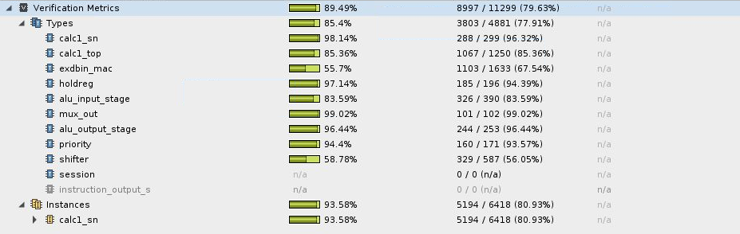
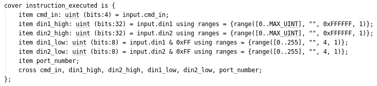
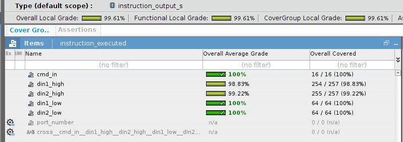

# Coverage Report

## Code Coverage

The testbench has 89% coverage of the calc1 code:

## Functional Coverage

The functional coverage is defined in `coverage.e` as follows:

And has results of 99% coverage:

